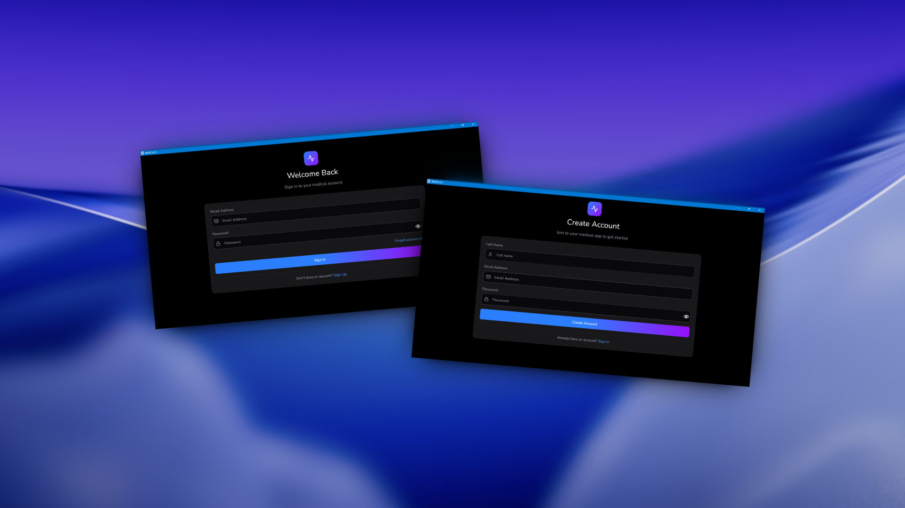
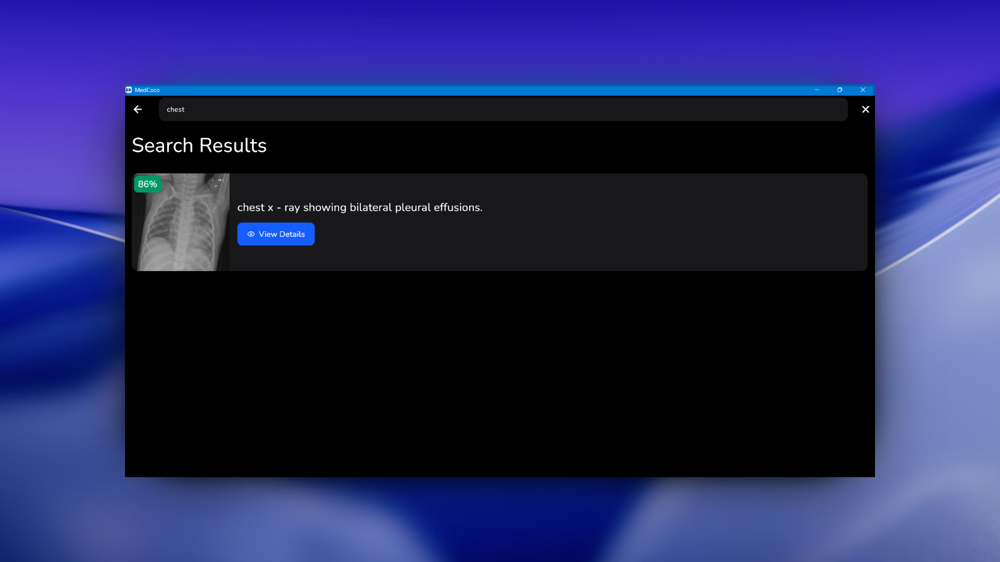
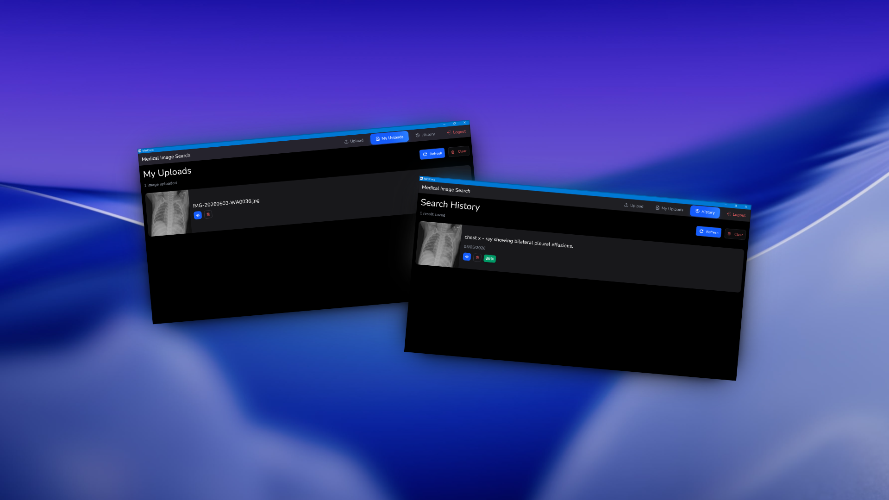
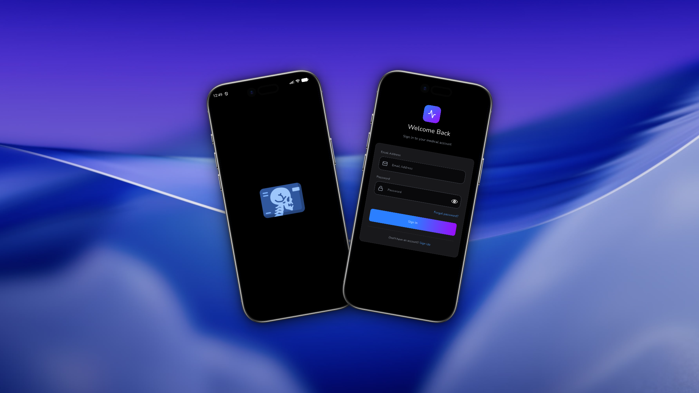
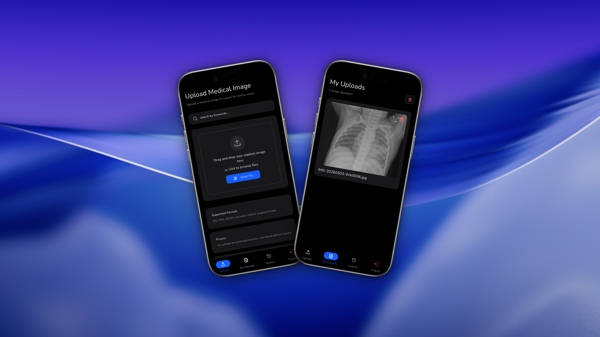
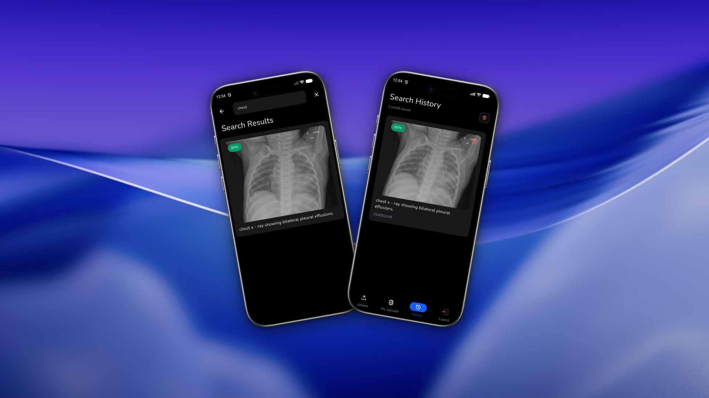

# Medcoco

<div align="center">

**AI-Powered Medical Imaging Search Platform**

Upload X-ray, MRI, CT images • Search with natural language • For doctors & students

</div>

---

## 📋 About

Medcoco is an AI-powered medical imaging search platform designed for healthcare professionals and medical students. It enables users to upload X-ray, MRI, and CT raw images, then search through them using simple natural language queries powered by AI. Doctors can quickly find specific cases for diagnosis, while medical students can efficiently search and study medical imaging cases.

### Key Capabilities
- 🩻 **Medical Image Upload** - Upload X-ray, MRI, CT raw images securely
- 🤖 **AI-Powered Search** - Find cases using simple natural language queries
- �‍⚕️ **For Doctors** - Quickly locate specific cases for diagnosis and reference
- � **For Students** - Search and study medical imaging cases efficiently
- 🔐 **Secure Authentication** - Multi-factor authentication with OTP verification
- 📱 **Cross-Platform** - Works seamlessly on mobile, desktop, and web


---

## 📸 Screenshots

### Desktop Experience

<div align="center">

| Authentication | Upload |
|----------------|--------|
|  |  |

| Search  | My Upload & History |
|------------------|---------------------|
|  |  |

</div>

### Mobile Experience

<div align="center">

| Authentication | Upload & My Upload |
|----------------|---------------------|
|  |  |

| Search & History |
|------------------|
|  |

</div>

---

## 🛠 Tech Stack

### Core Framework
- **Flutter** - Cross-platform UI framework
- **Dart** - Programming language (Dart 3.8+)

### State Management & Architecture
- **flutter_bloc** - State management with Cubit pattern
- **get_it** + **injectable** - Dependency injection
- **dartz** - Functional programming (Either for error handling)

### Networking & Data
- **dio** - HTTP client with interceptors
- **hive** + **hive_flutter** - Local NoSQL database
- **shared_preferences** - Simple key-value storage
- **flutter_secure_storage** - Secure storage for sensitive data

### Navigation & Routing
- **go_router** - Declarative routing
- **flutter_native_splash** - Splash screen configuration

### UI & UX
- **flutter_svg** - SVG image support
- **photo_view** - Zoomable image viewer
- **lottie** - Smooth animations
- **flutter_animate** - Animation utilities
- **pin_code_fields** - PIN/OTP input fields
- **otp_resend_timer** - OTP countdown timer

### File Handling
- **file_picker** - File selection
- **desktop_drop** - Drag-and-drop for desktop
- **cross_file** - Cross-platform file handling
- **background_downloader** - Background file downloads
- **cached_network_image** - Network image caching

### Desktop
- **window_manager** - Window management for desktop apps


---

## 📁 Project Structure

```
lib/
├── core/                          # Shared utilities and configurations
│   ├── di/                        # Dependency injection setup
│   ├── network/                   # API client and interceptors
│   ├── error/                     # Custom exceptions
│   ├── failure/                   # Failure classes
│   ├── theme/                     # App theming
│   ├── routes/                    # Router configuration
│   ├── utils/                     # Helper functions
│   └── widget/                    # Shared widgets
├── feature/                       # Feature modules
│   ├── auth/                      # Authentication feature
│   │   ├── data/                  # Models, repositories impl
│   │   ├── domain/                # Repository interfaces
│   │   └── presentation/          # Cubits, screens, widgets
│   ├── home/                      # Home dashboard
│   ├── upload/                    # File upload functionality
│   ├── my_upload/                 # Upload history
│   ├── search/                    # Search functionality
│   └── history/                   # History tracking
├── view/                          # Main app shell
└── main.dart                      # App entry point
```

---

## 🏗 Architecture

This project follows a **clean architecture** with clear separation of concerns:

```
┌─────────────────────────────────────┐
│     Presentation Layer              │
│  (Cubits, Screens, Widgets)         │
└──────────────┬──────────────────────┘
               │
┌──────────────▼──────────────────────┐
│      Domain Layer                   │
│  (Repository Interfaces, Entities)  │
└──────────────┬──────────────────────┘
               │
┌──────────────▼──────────────────────┐
│       Data Layer                    │
│  (Repository Impl, Services, Models)│
└─────────────────────────────────────┘
```

### Key Principles
- **Dependency Injection** - Using get_it + injectable
- **Error Handling** - Either<Failure, Success> pattern with dartz
- **State Management** - Cubit pattern with flutter_bloc
- **Repository Pattern** - Abstract interfaces in domain, implementations in data
- **Zero Flutter in Domain** - Pure Dart business logic

---

##  Development Guidelines

### Adding a New Feature

1. Create feature folder structure under `lib/feature/{feature_name}/`
2. Follow the architecture: `data/`, `domain/`, `presentation/`
3. Add repository interface in domain
4. Implement repository in data with `@LazySingleton` annotation
5. Create Cubit with proper state classes
6. Build UI screens and widgets
7. Register dependencies and run `dart run build_runner build`
8. Add route in go_router configuration

### Code Style

- Follow effective Dart guidelines
- Use `const` constructors wherever possible
- Keep widgets small and composable
- Avoid creating controllers in `build()` method
- Dispose controllers in `StatefulWidget.dispose()`

---

<div align="center">

**Built with ❤️ using Flutter**

[⬆ Back to Top](#medcoco)

</div>
